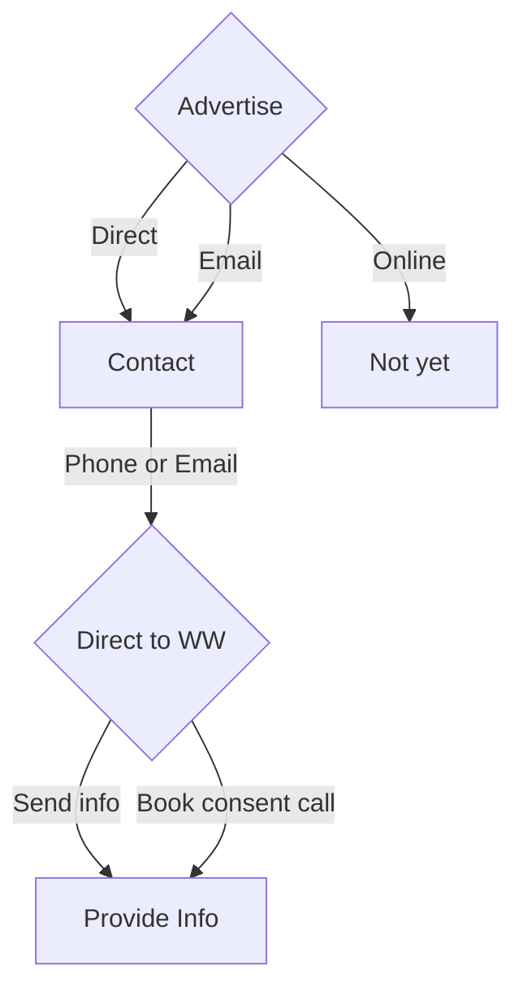
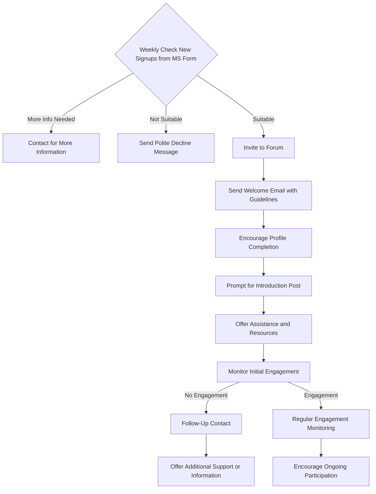
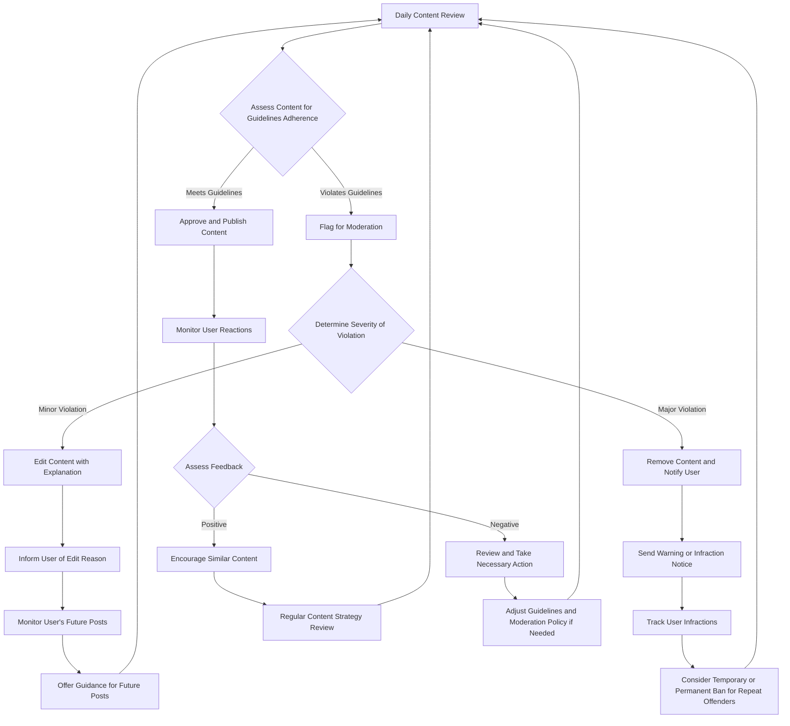

# Workflows

### Advertising

```mermaid
flowchart TD
    C{Advertise}
    C -->|Direct| D[Contact]
    C -->|Email| D[Contact]
    C -->|Online| F[Not yet]
    D -->|Phone or Email| G{Direct to WW}
    G -->|Send info| H[Provide Info]
    G -->|Book consent call| H[Provide Info]

```

### Signing up Members

```mermaid
flowchart TD
    C{Weekly Check New Signups from MS Form}
    C -->|More Info Needed| D[Contact for More Information]
    C -->|Not Suitable| E[Send Polite Decline Message]
    C -->|Suitable| F[Invite to Forum]
    F --> G[Send Welcome Email with Guidelines]
    G --> H[Encourage Profile Completion]
    H --> I[Prompt for Introduction Post]
    I --> J[Offer Assistance and Resources]
    J --> K[Monitor Initial Engagement]
    K -->|No Engagement| L[Follow-Up Contact]
    K -->|Engagement| M[Regular Engagement Monitoring]
    L --> N[Offer Additional Support or Information]
    M --> O[Encourage Ongoing Participation]


```

### Weekly forum management

```mermaid
flowchart TD
    A[Daily Content Review]
    A --> B{Assess Content for Guidelines Adherence}
    B -->|Meets Guidelines| C[Approve and Publish Content]
    B -->|Violates Guidelines| D[Flag for Moderation]
    C --> E[Monitor User Reactions]
    D --> F{Determine Severity of Violation}
    F -->|Minor Violation| G[Edit Content with Explanation]
    F -->|Major Violation| H[Remove Content and Notify User]
    G --> I[Inform User of Edit Reason]
    H --> J[Send Warning or Infraction Notice]
    E --> K{Assess Feedback}
    K -->|Positive| L[Encourage Similar Content]
    K -->|Negative| M[Review and Take Necessary Action]
    I --> N[Monitor User's Future Posts]
    J --> O[Track User Infractions]
    L --> P[Regular Content Strategy Review]
    M --> Q[Adjust Guidelines and Moderation Policy if Needed]
    N --> R[Offer Guidance for Future Posts]
    O --> S[Consider Temporary or Permanent Ban for Repeat Offenders]
    P --> A
    Q --> A
    R --> A
    S --> A

```
