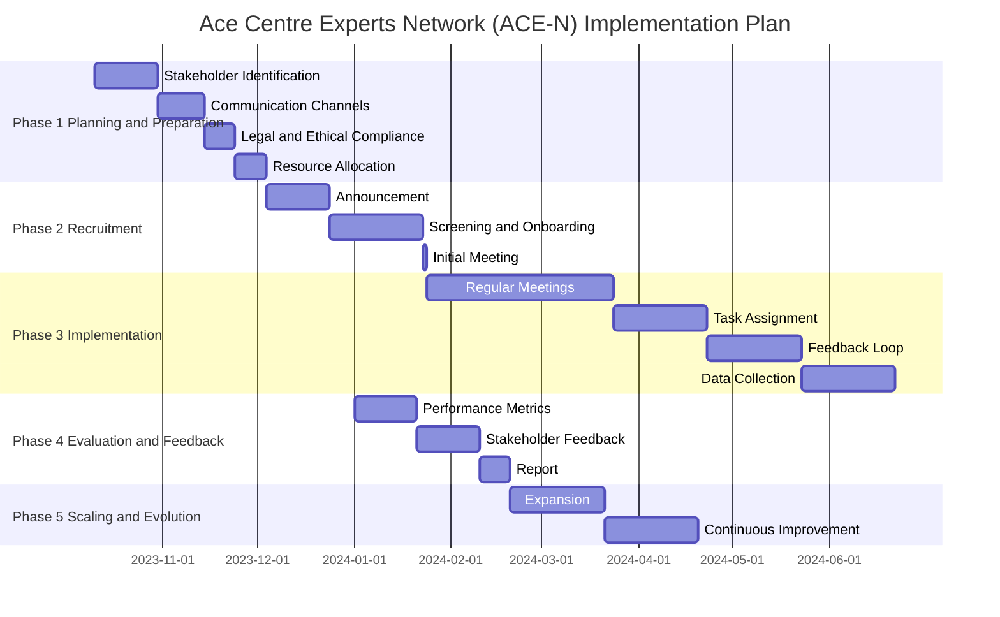

# 📅 Roadmap

Initally we want to focus on the **User Group** first. As such we created a small "Founding members" group for consultation. We presented the idea and consulted on initial questions.  Following feedback from this, the group felt that physical - face-to-face meetings are more desirable and practical given people's difficulties in communicating using online systems.  Also Email would be the easiest way for members to keep in touch and would be happy for Ace Centre to be involved in the name of the group. See the minutes of each meeting on the following pages- and feedback from this questionnaire

See below for a Gantt-style chart - or [click here ](https://mermaid.ink/img/pako:eNqFkk9r3DAQxb\_KoJMXbFhrNyn4VrJpobBJSdpDwJepNV6L6I-xpCZLyHfvaL1QbwvtnIw076f3xvMmOq9INOKALsbWAZfCSJ\_8ZDEC7HbVfl89Pc03UUdD8OBRWRzB9\_CxI7ghFyeC29eRphjmRnrtTFIU4IXoWeExgFxLWdV1JdfcMTcF6qL2Dr4HmuDz5NM4n-e6tagN9N4Y\_6LdAXoi9QO7Z-A2p6CGRTXKOyoB6xLyG7KSsoRa\_YbdDKinAMjCbPgboQVLFKEY8WjZ\_ukq6INL4wou0MgWfzIcOAxT5aZac4ZNCZsF\_-uAgdgTj4BB2S6P5hQICn7wjGxOs6XAYuwjR56R2\_UF6Rh0hwb2bC-DinujBrSXrs4sOAO3C-DmMvnfvEef4vBP3NUCt\_0Tl4PKRdDiDvM\_RLM6QVhyvZBf\_SdegOJLcrRqcvOHhZAhknWiFJZ4EbXiDX3LnFbEgSy1ouFPRT0mE1vRunduxRT949F1oolTolKkMW\_yTuNhQjsfvv8CDenZaQ?type=png)for a larger view. Detail on these phases are below.&#x20;

### Implementation Phases

#### Phase 1: Laying the Groundwork

**Objective**: To set the foundation for ACE-N by identifying who will be involved and how we will communicate with them.

* **Identify Stakeholders**: Determine who should be part of ACE-N, focusing on users, supporters, and professionals.
* **Choose Communication Methods**: Decide on the best ways to keep everyone in the loop, such as emails or online forums.
* **Legal Checks**: Make sure we have all the permissions we need to collect and store data.
* **Resource Planning**: Figure out what we need in terms of time, people, and money to make ACE-N a success.

#### Phase 2: Building the Team

**Objective**: To formally invite stakeholders to join ACE-N and get them up to speed.

* **Public Announcement**: Let the world know about ACE-N and invite people to join.
* **Onboarding**: Welcome new members and introduce them to how ACE-N works.
* **Kick-off Meeting**: Hold an initial meeting to set the stage for future collaboration.

#### Phase 3: Rolling Up Our Sleeves

**Objective**: To start the real work of ACE-N, from regular meetings to specific projects.

* **Hold Regular Meetings**: Keep the conversation going through scheduled get-togethers.
* **Assign Tasks**: Give everyone a role that plays to their strengths and interests.
* **Feedback Mechanism**: Create a way for members to share their thoughts on how things are going.
* **Data Gathering**: Collect the information we need to make ACE-N even better.

#### Phase 4: Taking Stock

**Objective**: To evaluate how well ACE-N is doing and where we can improve.

* **Measure Success**: Use key indicators to assess how well we're doing.
* **Gather Feedback**: Ask members what they think about ACE-N and how it could be better.
* **Share Updates**: Let members know how their input has made a difference.

#### Phase 5: Looking Ahead

**Objective**: To think about the future, from expanding ACE-N to refining our current activities.

* **Consider Expansion**: Think about bringing more people into ACE-N or tackling new challenges.
* **Continuous Improvement**: Use what we've learned to make ACE-N even better.

***

We aim to reach Phase 3 by January 2024. Your participation and feedback are crucial for the success of ACE-N. Together, we can make a meaningful impact in the field of AAC and eAT.
