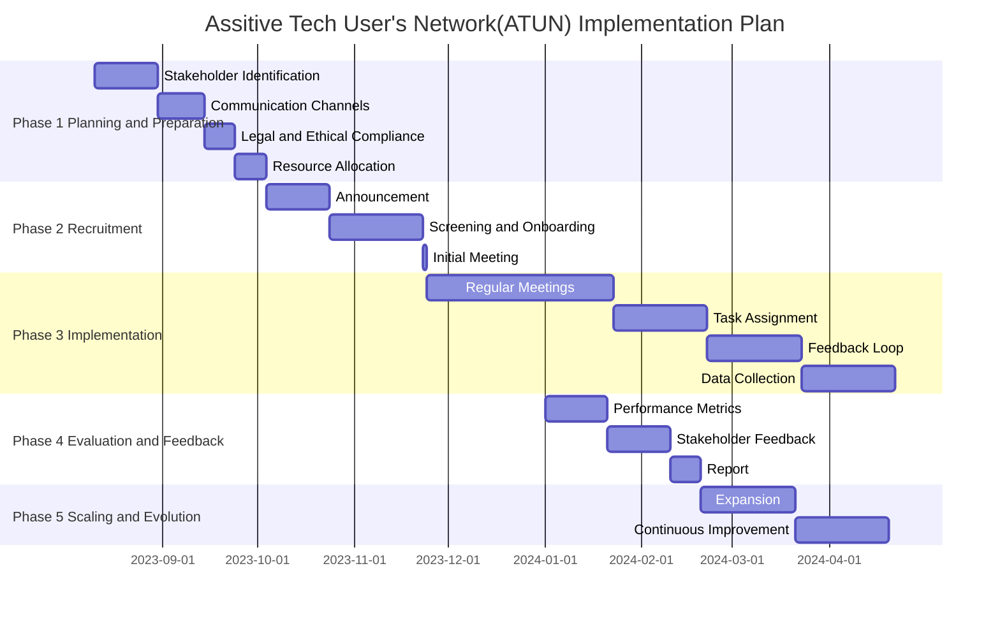

# 📅 Roadmap

### Current Situation - Summary

Initially, we want to focus on the **User Group** first. As such, we created a small "Founding members" group for consultation. We presented the idea and consulted on initial questions. Following feedback from this, the group felt that face-to-face meetings are more desirable and practical given people's difficulties in communicating using online systems. However, a significant group also raised the fact that it is sometimes more convenient to have asynchronous communication via online means. Email is preferable, but a way for people to see old discussions or share things beyond an email would be helpful. Researching solutions led to us to use discourse, which allows an email-only approach if necessary.

We aim to enrol a small group of people (around 20) in December 2023. This will allow us to check our onboarding processes for data collection and the online forum. We aim to have face-to-face and online meetings from early 2024.

### Roadmap

See below for a Gantt-style chart - or [click here ](https://mermaid.ink/img/pako:eNqFkk9r3DAQxb\_KoJMXbFhrNyn4VrJpobBJSdpDwJepNV6L6I-xpCZLyHfvaL1QbwvtnIw076f3xvMmOq9INOKALsbWAZfCSJ\_8ZDEC7HbVfl89Pc03UUdD8OBRWRzB9\_CxI7ghFyeC29eRphjmRnrtTFIU4IXoWeExgFxLWdV1JdfcMTcF6qL2Dr4HmuDz5NM4n-e6tagN9N4Y\_6LdAXoi9QO7Z-A2p6CGRTXKOyoB6xLyG7KSsoRa\_YbdDKinAMjCbPgboQVLFKEY8WjZ\_ukq6INL4wou0MgWfzIcOAxT5aZac4ZNCZsF\_-uAgdgTj4BB2S6P5hQICn7wjGxOs6XAYuwjR56R2\_UF6Rh0hwb2bC-DinujBrSXrs4sOAO3C-DmMvnfvEef4vBP3NUCt\_0Tl4PKRdDiDvM\_RLM6QVhyvZBf\_SdegOJLcrRqcvOHhZAhknWiFJZ4EbXiDX3LnFbEgSy1ouFPRT0mE1vRunduxRT949F1oolTolKkMW\_yTuNhQjsfvv8CDenZaQ?type=png)for a larger view. Details on these phases are below.

### Implementation Phases

#### Phase 1: Laying the Groundwork

**Objective**: To set the foundation for ATUN by identifying who will be involved and how we will communicate with them.

* [x] **Identify Stakeholders**: Determine who should be part of ATUN, focusing on users, supporters, and professionals.
* [x] **Choose Communication Methods**: Decide on the best ways to keep everyone in the loop, such as emails or online forums.
* [x] **Setup and design of Communication channels**
  * [x] **Data collection and interview processes formulated**
  * [x] **Design ATUN Discourse forum**
    * [x] **Suitable High contrast default theme to deal with VI issues**
    * [x] **Logo checks**
    * [x] **Settings verify (Email only should be possible)**
    * [x] **Design and check the onboarding process for new joiners**
* [x] **Legal Checks**: Ensure we have all the permissions we need to collect and store data.
* [x] **Resource Planning**: Figure out what we need in terms of time, people, and costs

#### Phase 2: Building the Team

**Objective**: To formally invite stakeholders to join ATUN and get them up to speed.

* [x] **Public Announcement**: Let the world know about ATUN and invite people to join. (See [Information Sheets](../marketing-materials/information-sheets.md))
* [x] **Onboarding**: Welcome new members and introduce them to how ATUN works.
  * [x] Onboarding online,
* [ ] **Kick-off Meeting**: Hold an initial meeting to set the stage for future collaboration.
  * [ ] Date set
  * [ ] Agenda Set

#### Phase 3: Rolling Up Our Sleeves

**Objective**: To start the real work of ATUN, from regular meetings to specific projects.

* [ ] **Hold Regular Meetings**: Keep the conversation going through scheduled get-togethers.
  * [ ] Set Dates for physical
  * [ ] Set Online dates
* [ ] **Assign Tasks**: Give everyone a role that matches their strengths and interests.
  * [ ] Task list created
  * [ ] Assignment
* [ ] **Feedback Mechanism**: Create a way for members to share their thoughts on how things are going.
  * [ ] Feedback forms
  *
* [ ] **Data Gathering**: Collect the information we need to make ATUN even better.

#### Phase 4: Taking Stock

**Objective**: To evaluate how well ATUN is doing and where we can improve.

* **Measure Success**: Use key indicators to assess how well we're doing.
* **Gather Feedback**: Ask members what they think about ATUN and how it could be better.
* **Share Updates**: Let members know how their input has made a difference.

#### Phase 5: Looking Ahead

**Objective**: To think about the future, from expanding ATUN to refining our current activities.

* **Consider Expansion**: Think about bringing more people into ATUN or tackling new challenges.
* **Continuous Improvement**: Use what we've learned to make ATUN even better.

***

We aim to reach Phase 3 by January 2024. Your participation and feedback are crucial for the success of ATUN. Together, we can make a meaningful impact in the field of AAC and eAT.
